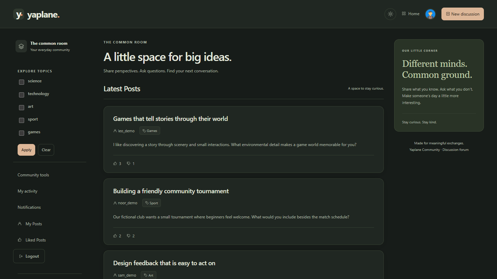

# Yaplane Community: Full Stack Discussion Forum

A full-stack discussion forum built with **Go, SQLite, and server-rendered HTML**, bringing categorized discussions, image uploads, account management, and community moderation into a responsive interface.

The project demonstrates HTTP handler development, session authentication, relational data modeling, authorization, and transactional persistence. One Go server serves the pages, static assets, and forum endpoints.

## Preview



The running application in dark mode, signed in with a fictional demo account. See [Run the fictional demo](#run-the-fictional-demo) to explore this populated forum locally.

## Key features

- **Discussions:** posts with multiple topics, optional image attachments, comments, and likes/dislikes on posts and comments.
- **Personal activity:** created posts, liked posts, comment history, and reaction history; authors can edit their own posts/comments and delete their own content.
- **Notifications:** persistent alerts for reactions and comments on your posts, unread counts, and a mark-all-as-read action.
- **Accounts:** email/password registration and login, optional Google/GitHub sign-in, profiles, bcrypt password hashing, and expiring sessions.
- **Moderation:** moderator requests, staff approval queues, moderator reports, administrator replies, role management, and managed topics.
- **Request protection:** HTTPS, Secure/HttpOnly/SameSite cookies, same-origin checks for mutations, rate limiting, and server timeouts.
- **Interface:** responsive layouts, topic filters, local SVG icons, labelled forms, keyboard focus indicators, and a dark-mode toggle matching the system preference until a choice is saved locally.

## Technology stack

| Layer | Technology |
| --- | --- |
| Backend | Go 1.22+, `net/http`, `html/template`, `database/sql` |
| Database | SQLite through `mattn/go-sqlite3` with CGO |
| Authentication | bcrypt, UUID session identifiers, Google/GitHub OAuth |
| Frontend | HTML, CSS, and plain JavaScript |
| Local environment | Docker and Docker Compose; Docker builds with Go 1.27.1 |

The frontend needs no framework, npm install, or build step. Pages use navigation and form submissions; JavaScript handles reaction requests and checks notification counts every 15 seconds while the inbox is visible. SQLite transactions enforce permissions and content updates, and database triggers persist notifications with the corresponding reactions/comments. A single database connection serializes writes.

## Run the standard app

Install Docker Desktop or Docker Engine with Compose and start Docker. Run these steps from the repository root. The standard app uses HTTPS on port **8080**. For a populated forum, follow [Run the fictional demo](#run-the-fictional-demo) instead.

**Git Bash on Windows:**

```bash
if [ ! -f .env ]; then cp .env.example .env; fi
notepad.exe .env
# Set HOST_PORT=8080 and OAUTH_BASE_URL=https://localhost:8080.
# Set both GOOGLE_CLIENT_ID and GOOGLE_CLIENT_SECRET to enable Google.
# Set both GITHUB_CLIENT_ID and GITHUB_CLIENT_SECRET to enable GitHub.
# Leave both values empty for any unused provider. Save and close Notepad.
docker compose build
docker compose up -d --force-recreate forum
```

**PowerShell:**

```powershell
if (!(Test-Path .env)) { Copy-Item .env.example .env }
notepad.exe .env
# Set HOST_PORT=8080 and OAUTH_BASE_URL=https://localhost:8080.
# Set both GOOGLE_CLIENT_ID and GOOGLE_CLIENT_SECRET to enable Google.
# Set both GITHUB_CLIENT_ID and GITHUB_CLIENT_SECRET to enable GitHub.
# Leave both values empty for any unused provider. Save and close Notepad.
docker compose build
docker compose up -d --force-recreate forum
```

Save these settings in `.env` before continuing past the editing step. Enter your own client ID and client secret for each provider you enable:

```dotenv
HOST_PORT=8080
OAUTH_BASE_URL=https://localhost:8080
GOOGLE_CLIENT_ID=
GOOGLE_CLIENT_SECRET=
GITHUB_CLIENT_ID=
GITHUB_CLIENT_SECRET=
```

Register the corresponding callback URL in each enabled provider application:

```text
https://localhost:8080/auth/google/callback
https://localhost:8080/auth/github/callback
```

Previously exported shell variables override `.env`; clear any conflicting values before starting. Docker generates the development certificate during the image build, so this setup requires no local Go installation or separate certificate command.

Open **[https://localhost:8080](https://localhost:8080)** and accept the self-signed certificate warning for local use. Register a local account or use a configured provider on the login or registration page. Local accounts work without provider credentials.

The application creates an empty database and five default topics automatically. Separate Docker volumes preserve the database and uploaded images across restarts.

After changing `.env`, apply the settings with:

```sh
docker compose up -d --force-recreate forum
```

Stop the app while keeping its data with:

```sh
docker compose down
```

This stops the app while keeping its data. Optional settings are listed in [.env.example](.env.example). Docker Compose reads settings from `.env`; native Go runs read shell environment variables.

### Native Go

Install Go 1.22 or newer and a C compiler with CGO enabled. From the repository root, generate the development certificate once and start the forum:

```sh
go run ./cmd/certgen
go run .
```

Reuse existing certificates on later starts. The generator refuses to overwrite files; use new `-cert` and `-key` paths when renewing and set `TLS_CERT_FILE` and `TLS_KEY_FILE` accordingly.

The native server uses **https://localhost:8080** and stores its database at `data/forum.db`. `DATABASE_PATH` changes database storage; `FORUM_ADDR` changes the native listener. Database files, generated certificates, and uploads are excluded from Git.

## Run the fictional demo

The demo uses its own Compose project and volumes, keeping it separate from standard data. Run these steps from the repository root in order. Set port **8081** so the demo can run beside the standard app on port 8080.

**Git Bash on Windows:**

```bash
if [ ! -f .env ]; then cp .env.example .env; fi
notepad.exe .env
# Set HOST_PORT=8081 and OAUTH_BASE_URL=https://localhost:8081.
# Optionally configure both credentials for each OAuth provider.
# Save and close Notepad before continuing.
docker compose -p yaplane-community-demo build
# First setup only: skip seeding if the demo database already exists.
MSYS_NO_PATHCONV=1 docker compose -p yaplane-community-demo run --rm forum /app/seed-demo
docker compose -p yaplane-community-demo up -d
```

**PowerShell:**

```powershell
if (!(Test-Path .env)) { Copy-Item .env.example .env }
notepad.exe .env
# Set HOST_PORT=8081 and OAUTH_BASE_URL=https://localhost:8081.
# Optionally configure both credentials for each OAuth provider.
# Save and close Notepad before continuing.
docker compose -p yaplane-community-demo build
# First setup only: skip seeding if the demo database already exists.
docker compose -p yaplane-community-demo run --rm forum /app/seed-demo
docker compose -p yaplane-community-demo up -d
```

Both setups read the same `.env`; set `HOST_PORT` and `OAUTH_BASE_URL` for the project you are starting or recreating. Clear any conflicting exported shell variables. For demo OAuth sign-in, register `https://localhost:8081/auth/google/callback` or `https://localhost:8081/auth/github/callback` with the corresponding provider. Docker generates the certificate automatically. The `MSYS_NO_PATHCONV=1` prefix prevents Git Bash from converting `/app/seed-demo` into a Windows path.

Open **[https://localhost:8081](https://localhost:8081)** and accept the self-signed certificate warning for local use. The seed creates **5 fictional accounts, 15 posts, 30 replies, and 90 reactions**. Post reactions and comments also populate the notification inboxes.

| Username | Sign-in email |
| --- | --- |
| alex_demo | alex_demo@example.com |
| mia_demo | mia_demo@example.com |
| sam_demo | sam_demo@example.com |
| noor_demo | noor_demo@example.com |
| leo_demo | leo_demo@example.com |

**Password for all demo accounts:** `DemoReview!2026`. Sign in using the email address. These are ordinary member accounts.

Browse topics, react to discussions, add a comment, then explore **Activity** and **Notifications**. Edit your own content to try the ownership controls. The homepage shows the latest ten posts; older discussions remain accessible through topic filters and personal activity.

Seed before the first demo startup. The command refuses any existing database file and never overwrites it. On later starts, keep `HOST_PORT=8081` and `OAUTH_BASE_URL=https://localhost:8081` in `.env` and use `docker compose -p yaplane-community-demo up -d` without seeding again. Use the same project name to reconnect to its existing volumes.

After changing demo settings in `.env`, apply them with:

```sh
docker compose -p yaplane-community-demo up -d --force-recreate forum
```

Stop the demo while keeping its data with:

```sh
docker compose -p yaplane-community-demo down
```

For native Go, seed a new file and select it in PowerShell before starting:

```powershell
go run ./cmd/seed-demo -database data/demo.db
$env:DATABASE_PATH = 'data/demo.db'
go run .
```

If the demo file already exists, skip the seed command. To return to standard storage after stopping the server, run `Remove-Item Env:DATABASE_PATH` and `go run .`. See [running.md](docs/running.md) for running both Docker versions together on separate ports.

## Authentication and moderation setup

Local accounts work without external credentials. Enable Google/GitHub sign-in using your own OAuth applications and matching HTTPS callback URLs, as described in [authentication.md](docs/authentication.md).

Register a private account, then assign the first administrator through the local command:

```sh
go run ./cmd/admin -email your-account@example.com
```

For the standard Docker project, use `docker compose exec forum /app/admin -email your-account@example.com`. Add `-p yaplane-community-demo` when targeting the demo project. The command selects `DATABASE_PATH` or accepts an explicit `-db` path.

Members publish immediately by default. Set `FORUM_PREMODERATE=true` before startup to require staff approval for new member posts/comments. Pending content is visible to its author and staff; role permissions are checked server-side. See [moderation.md](docs/moderation.md) for the complete workflow.

## Verification and technical limits

```sh
go build ./...
go vet ./...
docker compose config --quiet
```

Local verification covered clean and seeded HTTPS startup, demo login, discussion/topic pages, activity, notifications, database integrity, refusal to overwrite an existing seed file, Docker storage isolation, and persistence after restart. Automated test files are not included in the current tree. Live Google/GitHub provider sign-in and public deployment were not verified.

The upload limit currently applies to the entire 20 MiB multipart request. Rejected submissions can leave unused attachments, and deleting content does not remove its physical image file. See [image-upload-review.md](docs/image-upload-review.md) for these limitations. Development certificates are self-signed; public hosting requires trusted certificates. Rate limiting is in memory and uses the direct client IP.

Further implementation details are in [security.md](docs/security.md) and [advanced-features.md](docs/advanced-features.md).
